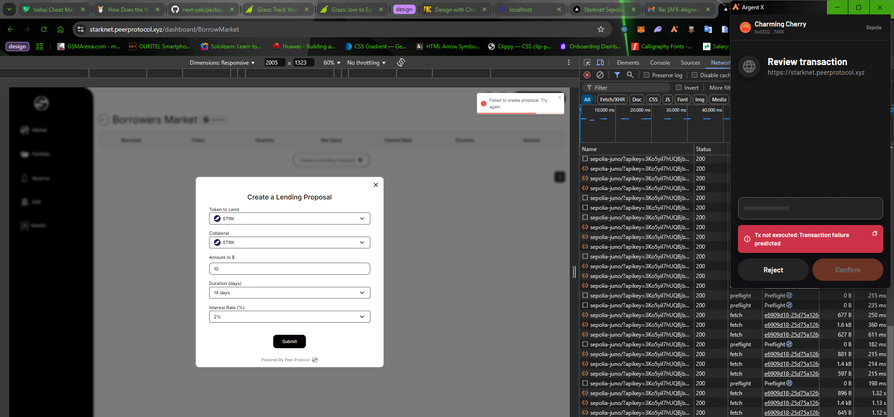
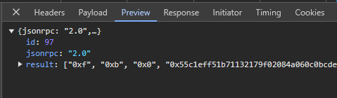
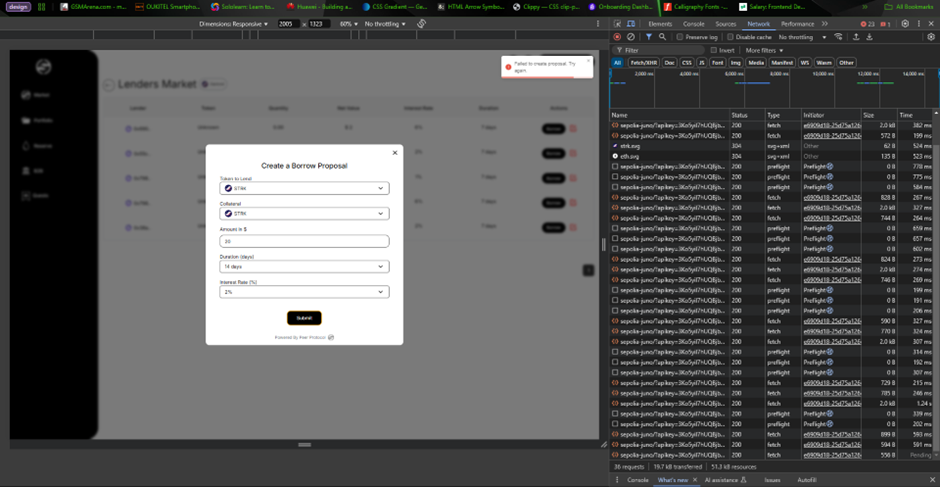
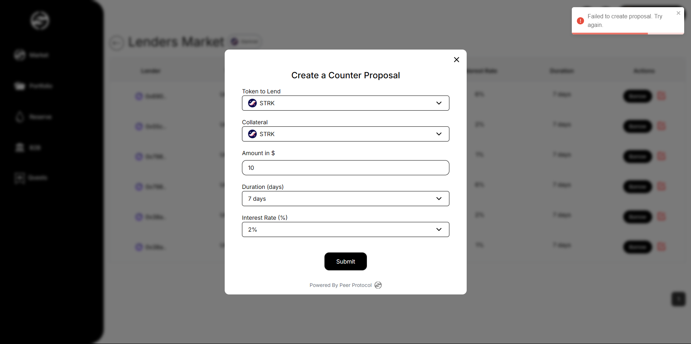

# Bug and Proposed solution sheet testing for Peerprotocol

## Bug one

### Proposal create failure(Lending)
**Test:** Proposal creating failure(Borrower's market)

***Response***  

**Steps to recreate**
- On the platform [here](https://starknet.peerprotocol.xyz/dashboard), create an account by linking your wallet, using the Argent browser extension.
- Ensure you are on the sepolia account.
- Establish your account by linking your email and twitter/X username
- Fund your account from [here](https://starknet-faucet.vercel.app/)
- With a funded account, head over to the markets, and toggle from protocol to P2P
- Click on the `Lend` button, which should take you to the Borrower's market
- The trade ammount should be between 10 - 20 dollars.
- When you are done putting in your parameters, create the transaction. You should get the error.

**Expected Output**: Lending Proposal created successfully  
**Actual Output**: Failed to create proposal. Try again.

## Bug two

### Proposal create failure (Borrowing)
**Test:** Proposal creating failure(Lender's Market)

**Steps to recreate**
- On the platform [here](https://starknet.peerprotocol.xyz/dashboard), create an account by linking your wallet, using the Argent browser extension.
- Ensure you are on the sepolia account.
- Establish your account by linking your email and twitter/X username
- Fund your account from [here](https://starknet-faucet.vercel.app/)
- With a funded account, head over to the markets, and toggle from protocol to P2P
- Click on the `Borrow` button, which should take you to the Lender's market
- The trade ammount should be between 10 - 20 dollars.
- When you are done putting in your parameters, create the transaction. You should get the error.

**Expected Output**: Borrow Proposal created successfully  
**Actual Output**: Failed to create proposal. Try again.

## Bug three

### Proposal create failure (Counter Proposal)
**Test:** Proposal creating failure(Lender's Market)

**Steps to recreate**
- On the platform [here](https://starknet.peerprotocol.xyz/dashboard), create an account by linking your wallet, using the Argent browser extension.
- Ensure you are on the sepolia account.
- Establish your account by linking your email and twitter/X username
- Fund your account from [here](https://starknet-faucet.vercel.app/)
- With a funded account, head over to the markets, and toggle from protocol to P2P
- Click on the `Borrow` button, which should take you to the Lender's market
- CLick the red edit icon to pop the modal open.
- Fill the details to create a counter proposal

**Expected Output**: Counter Proposal created successfully  
**Actual Output**: Failed to create proposal. Try again.

## Bug four

### Borrow button not functional

**Issue:** Triggering the borrow button triggers all the buttons on the table, and does nothing   
**ProposedFix:** The buttons should be mapped to their table row using a unique ID from the table details. Clicking the button should bring up a confirmation modal to validate the trade/lending process.