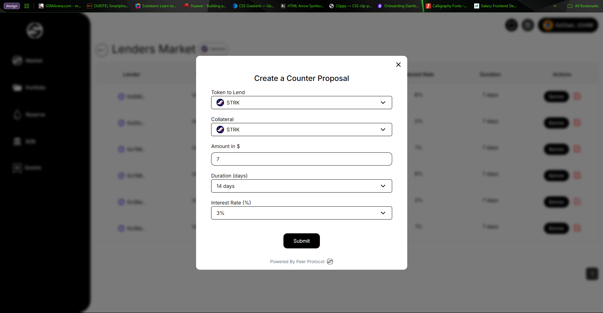

# Bug and Proposed solution sheet testing for Peerprotocol

## Bug one

### Cannot create borrow proposal
**Test:** Proposal creating failure(on systems with high traffic, hasn't been shut down a while)

**Steps to recreate**
- On the platform [here](https://starknet.peerprotocol.xyz/dashboard), create an account by linking your wallet, using the Argent browser extension.
- Ensure you are on the sepolia account.
- Establish your account by linking your email and twitter/X username
- Fund your account from [here](https://starknet-faucet.vercel.app/)
- Head to profile, and ensure you fund your account from your wallet to the platform
- With a funded account, head over to the markets, and toggle from protocol to P2P
- Click on the `Borrow` button, which should take you to the Lender's market
- The trade ammount should be between 10 - 20 dollars.
- When you are done putting in your parameters, create the transaction. You should get the error.

**Expected Output**: Lending Proposal created successfully  
**Actual Output**: Failed to create proposal. Try again.

*This is specific when your system has been running for a while without being shut down.*

## Bug two

### Retain borrow proposal on counter proposal form
**Test:** counter proposal showing proposal details

**Steps to recreate**
- Using the steps above to go to the Lender's market
- Create a borrow proposal.
- try to create a counter proposal to any on the table listed

**Expected Output**: A clear form showing ready for entry  
**Actual Output**: Persisted data from borrow proposal on counter proposal
**Proposed Fix:** Clear the form each time a transaction is made, and use pointer ids to indicate on the table which row called the function

## Bug three

### Proposal create persist (Borrow Proposal)
**Test:** Proposal creating failure(Lender's Market)

**Steps to recreate**
- Using the above method from `Bug One` and `two`
- Try to create a new borrow proposal

**Expected Output**: new form with Borrow proposal at the title  
**Actual Output**: Persists the form from create counter proposal with the information still persisting

## Bug four

### Borrow button affects predecessors

**Issue:** Triggering the borrow button triggers all the buttons on the table, and does nothing   
**ProposedFix:** The buttons should be mapped to their table row using a unique ID from the table details. Clicking the button should bring up a confirmation modal to validate the trade/lending process.